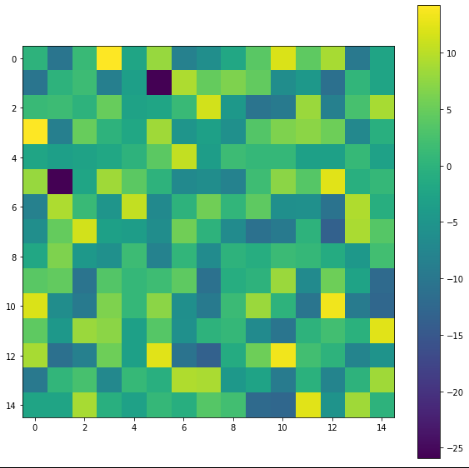

# Spatio-Temporal Deep Learning for fMRI analysis

## Dataset




## Tensorboard

To visualise experiments logs in tensorbard run the following line:

``` tensorboard --logdir='./logs/' ```

## Docker 

```docker build ./config```

``` docker run -it --rm --env CUDA_VISIBLE_DEVICE=0 --gpus all -v /home/sd20/workspace:/workspace -v /home/sd20/workspace/data:/data/ --workdir=/workspace  stgcn```

``` docker tag 267a0d195121 stgcn ```


## Useful Links

ST-GCN - Gadgil et al 2020, [Spatio-Temporal Graph Convolution for Functional MRI Analysis](https://github.com/sgadgil6/cnslab_fmri)

MS-G3D - Liu et al 2020, [Disentangling and Unifying Graph Convolutions for Skeleton-Based Action Recognition](https://github.com/kenziyuliu/MS-G3D)

## Results

### Sex classification 

**Multi-layer Perceptron** (MLP) classifier 


| Model | Data | Input Features | Architecture | Train-accuracy | Validation-accuracy | Remarks |
| ------ |  ----| --  | ----------| ----------| ----------| --- |
| ST-GCN | cov matrix - **22** ROIs  | 253 |  (64,64,1)  | **0.828**  | **0.752** | 5-folds average, SGD 1e-2 |
| ours   | ICA15   | 105 |(64,64,1)   | **1.00**   | **0.847**  | dropout 0.5, Adam 1e-4 | 
| ours   | ICA25   | 300 | (64,64,1)   | **1.00**    | **0.835**  |  same |
| ours   | ICA50   | 1225 | (64,64,1)   | **1.00**    | **0.902**  | same | 
| ours   | ICA100   | 4950 | (64,64,1)   | **1.00**    | **0.961**  | same | 
| ours   | ICA200   | 19900 | (64,64,1)   | **1.00**    | **0.957**  | same |
| ours   | ICA300   | 44850 | (64,64,1)   | **1.00**    | **0.968**  | same |


------

**Graph Convolution Networks** (GCN) classifiers

All results are obtained following a 5-fold cross validation

| Model | Data |  Accuracy % (paper)| Batch size | Iterations |Window size | Remarks |
| ------ |  ----| --  | ----------|  ----------|   ----------| ----------|
| ST-GCN | **22 ROIs**  | **0.752** | 5-folds average, SGD 1e-2 | xxx | xxx | xxx |
| MS-G3D   | **22 ROIs**    |**0.847**  | dropout 0.5, Adam 1e-4 | xxx | xxx |xxx |

| Model | Data |  Accuracy % (paper)| Batch size | Iterations |Window size | Remarks |
| ------ |  ----| --  | ----------|  ----------|   ----------| ----------|
| ST-GCN   | Nodes TS - 15   | **79.8**  |  512 | 10k | 50 | Adam, 1e-3  |
| ST-GCN   | Nodes TS - 15   | **75.9**  |  512 | 2k | 50 | Adam, 1e-3  |
| ST-GCN   | Nodes TS - 15   | **76.7**  |  512 | 2k | 75 | Adam, 1e-3  |
| ST-GCN   | Nodes TS - 15   | **76.6**  |  512 | 2k | 100 | Adam, 1e-3  |
|   |   |   |  |  || |   |
| ST-GCN   | Nodes TS - 25       | **82.1**  | 512 | 10k | 50 | Adam, 1e-3  |
| ST-GCN   | Nodes TS - 25       | **78.3**  | 512 | 2k | 50 | Adam, 1e-3  |
| ST-GCN   | Nodes TS - 25       | **79.8**  | 512 | 2k | 75 | Adam, 1e-3  |
| ST-GCN   | Nodes TS - 25       | **77.8**  | 512 | 2k | 100 | Adam, 1e-3  |
|   |   |   |  |  || |   |
| ST-GCN   | Nodes TS - 50      | **86.5**  | 512 | 10k | 50 |  Adam, 1e-3 |
| ST-GCN   | Nodes TS - 50      | **82.4**  | 512 | 2k | 50 |  Adam, 1e-3 |
| ST-GCN   | Nodes TS - 50      | **81.6**  | 512 | 2k | 75 |  Adam, 1e-3 |
| ST-GCN   | Nodes TS - 50      | **79.6**  | 512 | 2k | 100 |  Adam, 1e-3 |
|   |   |   |  |  || |   |
| ST-GCN   | Nodes TS - 100      | **82.6**  | 256 | 2k | 50 | Adam, 1e-3  |
| ST-GCN   | Nodes TS - 200       | **89.2**  | 256 | 2k | 50 | Adam, 1e-3  |
| ST-GCN   | Nodes TS - 200       | **91.5**  | 256 | 10k | 50 | Adam, 1e-3  |
| ST-GCN   | Nodes TS - 300      | **87.2**  | 128 | 2k | 50 | Adam, 1e-3  |

| Model | Data |  Accuracy % (paper)| Batch size | Iterations |Window size | Remarks |
| ------ |  ----| --  | ----------|  ----------|   ----------| ----------|
| MS-G3D   | Nodes TS - 15   | **59.1**  |  256 | 2k | 10 | Adam, 1e-3  |
| MS-G3D   | Nodes TS - 15   | **80.0**  |  256 | 2k | 50 | Adam, 1e-3  |
| MS-G3D    | Nodes TS - 15   | **80.1**  |  256 | 2k | 75 | Adam, 1e-3  |
| MS-G3D    | Nodes TS - 15   | **81.5**   |  128 | 2k | 100 | Adam, 1e-3  |
|   |   |   |  |  || |   |
| MS-G3D    | Nodes TS - 25       |  **84.5**  | 256 | 2k | 50 | Adam, 1e-3  |
| MS-G3D    | Nodes TS - 25       |  **85.2**   | 128 | 2k | 75 | Adam, 1e-3  |
| MS-G3D    | Nodes TS - 25       |  **85.1**  | 128 | 2k | 100 | Adam, 1e-3  |
|   |   |   |  |  || |   |
| MS-G3D    | Nodes TS - 50       |  **89.5**  | 256 | 2k | 50 | Adam, 1e-3  |
| MS-G3D    | Nodes TS - 50       |  **x**   | 128 | 2k | 75 | Adam, 1e-3  |
| MS-G3D    | Nodes TS - 50       |  **x**  | 128 | 2k | 100 | Adam, 1e-3  |
|   |   |   |  |  || |   |
| MS-G3D    | Nodes TS - 100       |  **x**  | 256 | 2k | 50 | Adam, 1e-3  |
| MS-G3D    | Nodes TS - 100       |  **x**   | 128 | 2k | 75 | Adam, 1e-3  |
| MS-G3D    | Nodes TS - 100      |  **x**  | 128 | 2k | 100 | Adam, 1e-3  |


### Fluid intelligence prediction 

|  | Train-accuracy | Validation-accuracy |
| ---      |  ------  |----------|
| ICA15   | xxx   | xxx  |
| ICA25   | xxx   | xxx  |
| ICA50   | xxx   | xxx  |
| ICA100   | xxx   | xxx  |
| ICA200   | xxx   | xxx  |
| ICA300   | xxx   | xxx  |


